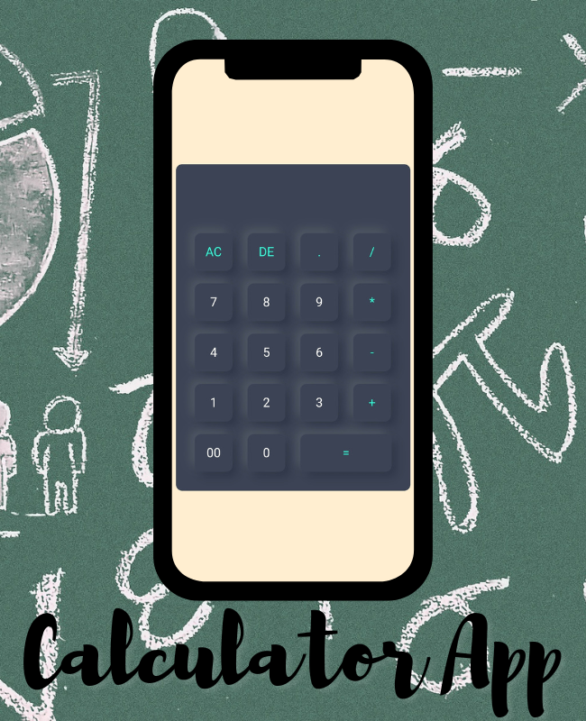

# Calculator
<h3>This is a simple calculator, using basic HTML, CSS, JavaScript.</h3>

<h3> The basic calculator web app is a user-friendly and functional tool designed for mathematical computations. It includes all the essential keys of a standard calculator, such as numerical digits, arithmetic operators, and decimal point. Additionally, the calculator features an 'all clear' button to clear all input values, and a 'delete' button to remove the last entered digit. With a simple and intuitive interface, this calculator app provides an easy-to-use solution for a variety of everyday calculations.<h3/>
